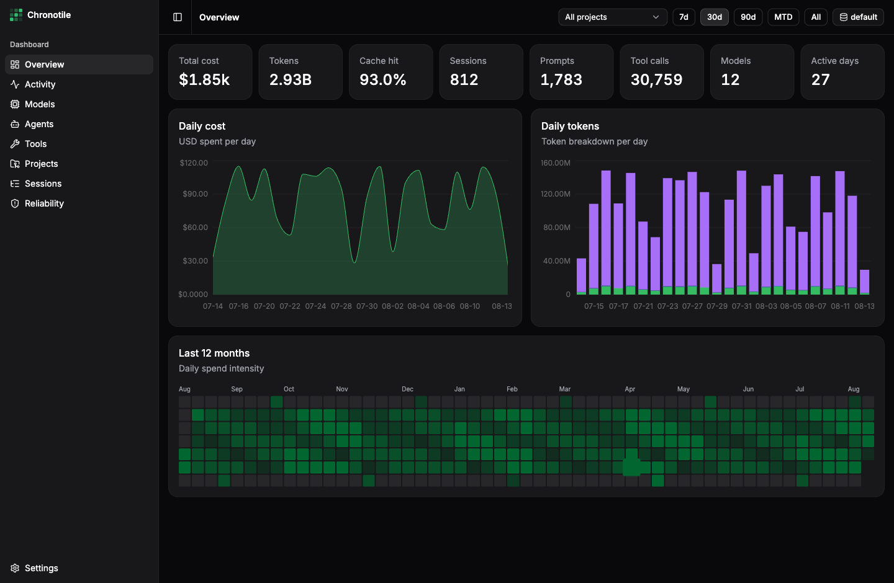

<div align="center">


# Chronotile

**Local usage analytics for [opencode](https://opencode.ai) — cost, tokens, models, agents, tools, skills, and sessions, tiled by day.**




</div>

---

## Why Chronotile?

opencode records every session, message, token, and tool call in a local SQLite database — and then
never shows you any of it. How much did this month cost? Which model burns the budget? Which project
eats the tokens? What does your agent actually *do* all day? The data is sitting on your disk;
Chronotile turns it into a dashboard.

- 📊 **Every stat that matters** — spend, tokens (including reasoning and cache), models, agents,
  tools, skills, projects, sessions, errors — all filterable by project and time range.
- ⚡ **Instant on multi-gigabyte databases** — an incremental rollup cache answers every query in
  milliseconds, no matter how large your history grows.
- 💸 **Cost you can actually see** — opencode only records a price for metered API traffic, so
  subscription and OAuth-plan messages are stored as `$0`. Chronotile prices their tokens from
  [models.dev](https://models.dev) and shows reported and estimated cost side by side.
- 🔒 **Local and read-only** — your opencode databases are opened read-only, nothing is modified,
  and no usage data ever leaves your machine. The app makes two network requests, both optional
  and neither carrying your data: a [release check and a pricing refresh](#data--privacy).

Chronotile is a native desktop app (Tauri 2, Rust backend, React + shadcn/ui frontend). It
auto-detects your default opencode database and lets you register any number of additional ones —
for example per-profile databases created by [ocp](https://github.com/xterr/ocp).

## Features

- **Overview** — total cost, token breakdown, cache-hit rate, what prompt caching saved you, how
  each figure compares with the previous period, and a GitHub-style full-year calendar heatmap of
  daily spend or token intensity, with the selected range highlighted and the rest dimmed.
- **Reported and estimated cost** — opencode writes `$0` for subscription and OAuth-plan traffic,
  which on a real database is most of it. Token counts are always recorded, so cost is also derived
  from models.dev rates. Recomputing metered messages this way reproduces opencode's own totals to
  the cent, which is what makes the estimate comparable rather than a parallel invention. Switch
  between **Estimated**, **Reported** and **Both** in Settings.
- **Quota & burn rate** — rolling usage windows (5 h by default, matching Claude subscriptions and
  settable for other plans), current burn rate in tokens and dollars, and where the window lands if
  you keep going. opencode does not record plan limits, so the gauge is measured against your own
  busiest window and says so.
- **Per-model stats** — cost share, daily stacked trends, message/session counts, and median
  output tokens-per-second measured from your own traffic. Each row expands into its individual
  variants (reasoning effort and friends); the provider is shown as a `provider/model` label.
- **Agent & tool analytics** — which agents spend the money (same breakdown as models, variants
  included); per-tool call counts, error rates, and p50/p95 durations.
- **Skills** — how often each skill is loaded, split between preloaded by a task and invoked
  directly, with the sessions, projects, and first/last use behind each one.
- **Projects & files** — spend and activity per repository, including sessions from non-git
  directories, plus the individual files the agent read, edited and wrote most.
- **Merged agent names** — opencode stores agents by display name with no id, so a rename splits
  one agent across several rows. Spellings differing only by case, spacing or invisible characters
  are folded together; genuinely different agents are never merged. Toggle it off in Settings.
- **Session browser with transcripts** — expand any session into its subagent children, then read
  the conversation: messages, tool calls with durations, reasoning, file patches, and errors.
- **Reliability** — error breakdown by type, aborted-message rate, compactions, and retries.
- **Project filter & time ranges** — a searchable project picker and 7d / 30d / 90d / MTD / All
  ranges, persisted across restarts.
- **Multiple databases** — the default opencode database is detected automatically; add or remove
  others manually and switch with one click, or rebuild a source's index on demand.
- **In-app updates** — a silent check at launch prompts you only when a new version exists; trigger
  it yourself from the app menu's **Check for Updates…** or **Settings → Updates**, and install with
  one click. The launch check can be disabled in **Settings → Preferences**.
- **Native polish** — light/dark/system theme with a matching macOS title bar, collapsible icon
  sidebar, and a fixed, no-overscroll shell.

## Install

Grab a build from the [latest release](https://github.com/xterr/chronotile/releases/latest):

| Platform | Artifact |
| --- | --- |
| macOS (Apple Silicon + Intel) | `_macos_universal.dmg` |
| Windows | `_windows_x64-setup.exe` (installer) or `_windows_x64.msi` |
| Linux | `_linux_x86_64.AppImage`, `_linux_amd64.deb`, or `_linux_x86_64.rpm` |

> [!IMPORTANT]
> macOS builds are **not signed or notarized**, so Gatekeeper blocks the first launch. Allow it
> once under **System Settings → Privacy & Security → Open Anyway**, or run
> `xattr -dr com.apple.quarantine /Applications/Chronotile.app`. Right-click → **Open** no longer
> works for unsigned apps on macOS 15 (Sequoia) and later.

### Build from source

```sh
git clone git@github.com:xterr/chronotile.git
cd chronotile
yarn install
yarn tauri build
```

The bundled app lands in `src-tauri/target/release/bundle/` — `.app`/`.dmg` on macOS,
NSIS installer and `.msi` on Windows, `.deb`/`.rpm`/`.AppImage` on Linux.

**Prerequisites:** [Rust](https://rustup.rs) (stable), Node.js ≥ 20 with
[corepack](https://nodejs.org/api/corepack.html) enabled (Chronotile uses Yarn 4), and the
[Tauri platform dependencies](https://v2.tauri.app/start/prerequisites/) for your OS.

## Quick start

1. Launch Chronotile — your default opencode database (`~/.local/share/opencode/opencode.db`,
   or `~/Library/Application Support/opencode/opencode.db` on macOS) is detected automatically
   and indexed in the background (a few seconds per gigabyte, one time only).
2. Add more databases via **Settings → Data sources** or the database menu in the top bar —
   useful for [ocp](https://github.com/xterr/ocp) profile databases.
3. Pick a project and a time range in the top bar; every page follows.
4. Data refreshes automatically every minute; use **Refresh data** in the database menu to
   force it.

## How it works

Chronotile never queries your opencode database directly from the UI. A Rust ingest engine mirrors
it into a compact local rollup cache, and the dashboard reads only from that:

| What | Where | Notes |
| --- | --- | --- |
| opencode databases | wherever they live | opened **read-only**, WAL-safe alongside a running opencode |
| rollup cache | `~/Library/Application Support/design.xterr.chronotile/cache.db` | day-grain star-schema facts; ~15 MB for 10 GB of sources |
| registered sources | `.../design.xterr.chronotile/sources.json` | the manually added database paths |
| model pricing | bundled in the binary, overridable at `.../pricing.json` | models.dev rates, applied when a query runs |
| refresh | every 60 s + manual trigger | incremental: only new rows are read |

The ingest is incremental by design: each cycle is an indexed range scan past a stored `rowid`
watermark — never a full rescan. (opencode's message and part *ids* are deliberately not used for
this: they are not monotonic with insertion order, so an id-keyed watermark skips new rows.
SQLite assigns `rowid` in insertion order, which is exactly what the scan needs.) In-flight messages are held in
a pending set until their cost and tokens are final; a per-cycle sentinel detects deletions
(session removals, reverts) and rebuilds the affected source automatically. The cache schema is
versioned with forward-only migrations that run on startup, so upgrades are automatic — including
migrations that require re-ingesting the sources.

Prices are deliberately *not* baked into the facts. They live in their own table and are joined when
a query runs, so correcting a rate or refreshing the catalog re-costs your entire history without
re-reading a single source row — a few tens of milliseconds, no re-index.

## Pages

| Page | What it shows |
| --- | --- |
| **Overview** | Stat cards with period-over-period change, cache savings, daily cost, daily token mix, full-year heatmap |
| **Quota** | Rolling usage window, burn rate, projected end-of-window, recent windows |
| **Activity** | Messages & sessions per day, working-hours punch card |
| **Models** | Cost share donut, stacked daily cost, per-model table with p50 tok/s, expandable per variant |
| **Agents** | The same breakdown, keyed by agent |
| **Tools** | Call counts, error rates, p50/p95 durations, and calls repeated with identical arguments |
| **Skills** | Loads per skill split into preloaded-by-task vs. invoked-directly, with sessions and projects |
| **Projects** | Spend per repository, with per-directory attribution for non-git work |
| **Files** | The files touched most, split into reads, edits and writes |
| **Sessions** | Median / p95 / peak session cost, plus a filterable session tree with subagent children and paged transcript drill-down |
| **Reliability** | Errors by type *and message*, context-window pressure, compactions, retries |
| **Settings** | Theme, cost basis, agent merging, quota window, data sources, model pricing, updates |

## Data & privacy

Everything is local. Chronotile reads your opencode databases read-only and writes only to its own
application directory:

```
~/Library/Application Support/design.xterr.chronotile/   # macOS
~/.config|~/.local/share/design.xterr.chronotile/        # Linux
%APPDATA%\design.xterr.chronotile\                       # Windows
├── sources.json    # registered database paths
├── pricing.json    # refreshed models.dev rates (absent until you refresh; falls back to the bundled copy)
└── cache.db        # derived rollup cache (safe to delete; rebuilds)
```

No telemetry, no accounts, no analytics. Chronotile makes exactly two network requests, both
outbound-only, both optional, and neither carries anything about your usage:

| Request | What it asks for | What it sends | When | Turn it off |
| --- | --- | --- | --- | --- |
| Release check | `releases/latest/download/latest.json` from GitHub | nothing but the request | once at launch, silent unless an update exists, plus **Check for Updates…** | **Settings → Preferences** |
| Pricing refresh | `api.json` from [models.dev](https://models.dev) — a public price list | nothing but the request | in the background, at most once a day, plus **Refresh pricing** | **Settings → Preferences** |

The pricing request deserves a note, because it is the one that touches cost. It downloads a public
catalog of published model rates — the same file anyone can open in a browser. It does not upload
your models, token counts, or spend, and there is no server to upload them to. A snapshot ships
inside the binary, so cost is priced correctly on first run with no network at all; refreshing only
keeps that snapshot from going stale. Turn both checks off and the app makes no network requests
whatsoever.

Rates are applied when a query runs rather than stored on your data, so refreshing pricing never
re-reads or rewrites your history.

Note that the rolling-window figures on the **Quota** page are built from per-message samples kept
for 14 days. Everything older is served from the day-grain rollups, so deleting `cache.db` loses
that recent detail until it rebuilds from the sources.

## Development

```sh
yarn install
yarn tauri dev       # runs vite + the tauri shell with hot reload
```

Quality gates:

```sh
yarn typecheck                                     # tsc
yarn lint                                          # eslint
yarn build                                         # vite production build
cargo check --manifest-path src-tauri/Cargo.toml   # rust
```

The frontend lives in `src/` (React 19, Tailwind 4, shadcn/ui, Recharts, TanStack Query); the backend in
`src-tauri/src/` — `cache/` holds the ingest engine, migrations, and read layer. Logo proposals
and brand assets live in `design/`.

## Releasing

The git tag is the single source of truth. To cut a release:

```sh
git tag 0.2.0            # exact version, no v prefix
git push origin 0.2.0
```

Pushing the tag triggers [`release.yml`](.github/workflows/release.yml): it stamps the tag's version
into `tauri.conf.json`, `package.json`, and the Cargo manifests, builds on macOS (universal —
Apple Silicon + Intel), Windows, and Linux in parallel, generates release notes from the
conventional-commit history with [git-cliff](https://git-cliff.org), and publishes a GitHub Release
with every artifact attached: `.dmg`, `-setup.exe`, `.msi`, `.AppImage`, `.deb`, and `.rpm`. After a
successful release, a follow-up job commits the version bumps and the regenerated `CHANGELOG.md`
back to `main` — no manual version editing anywhere.

Builds are [signed and notarized](https://v2.tauri.app/distribute/sign/macos/) automatically when
the repository has the following secrets: `APPLE_CERTIFICATE` (base64 `.p12` with a *Developer ID
Application* identity), `APPLE_CERTIFICATE_PASSWORD`, and — for notarization — `APPLE_ID`,
`APPLE_PASSWORD` (app-specific password), and `APPLE_TEAM_ID`. These are **not** currently
configured, so published macOS builds ship unsigned (ad-hoc signature only) and Gatekeeper blocks
them on first launch.

In-app updates ship alongside the release when the `TAURI_SIGNING_PRIVATE_KEY` secret (and
`TAURI_SIGNING_PRIVATE_KEY_PASSWORD`, if the key has one) is configured: the workflow then also
builds [updater artifacts](https://v2.tauri.app/plugin/updater/) (`.app.tar.gz` plus `.sig`
signatures for the NSIS, MSI, and AppImage bundles) and publishes a `latest.json` manifest that the
app's **Settings → Updates** check reads. Generate the keypair once with
`yarn tauri signer generate -w ~/.tauri/chronotile.key`; the matching public key lives in
`tauri.conf.json`. Updates apply in place on macOS (universal), Windows (NSIS/MSI), and Linux
(AppImage only — `.deb`/`.rpm` installs update through the package manager).

## Uninstall

```sh
rm -rf /Applications/Chronotile.app                                    # the app
rm -rf ~/Library/Application\ Support/design.xterr.chronotile          # cache + sources
```

Your opencode databases are never touched.

## License

[MIT](LICENSE) © xterr
